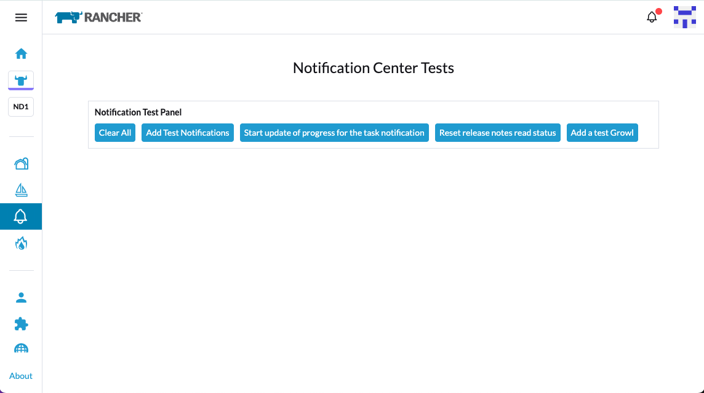

# Notifications Test

UI Extension that adds an item in the application bar that allows you to test the Notifications Center.

## Installation

To install this extension in Rancher Manager, add this repository as a Helm Repository - to do this:

- Go to the local cluster, to 'Apps' and 'Repositories'
- Click 'Create' and enter a name, e.g. 'example-extensions'
- Choose Target 'http(s) URL to an index generated by Helm'
- Enter https://nwmac.github.io/notifications-test for the 'Index URL'
- Click Create

Once the repository is added, to install:

- Go to `Extensions` in the side bar:
- Go to the `Available` tab
- Install the `Notifications-Test` extension
- Reload the UI once the extension has installed

Once installed, a bell icon should appear in the left-hand application bar.

## Using

Click the `bell` icon to access the text page:

The extensions should then appear on the 'Extenssions' page in Rancher Manager.

There are a number of buttons:

- Clear All - will remove all notificatiopns
- Add Test Notifications - will add a set of test notifications
- Start update of progress ... - will start a timer that increases the progress of the task notification. Note: This onlty works once the 'Add Test Notifications' button has been clicked - this button will update the progress notification added by it.
- Reset release notes read status - If you clear all notifications, you won't get back the Release Notes notification, as its read status is recorded in a user preference. This button will reset that user preference, so if you clear all notifications, click this button and refresh the browser, the release notes notification should be re-added
- Add a test Growl - adds a growl, which will also show up as a notification

